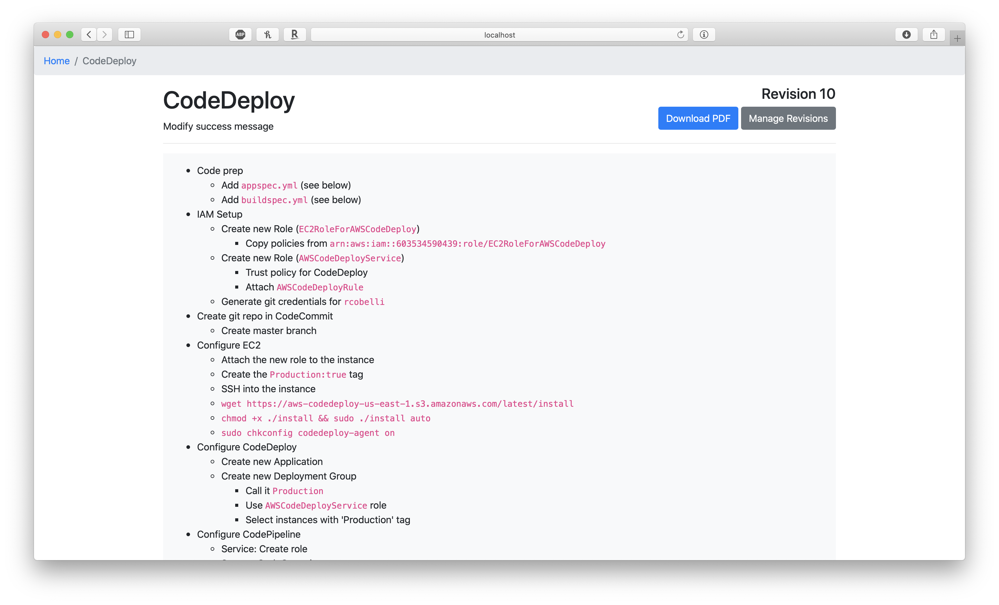

# Michael - Personal CRM
##### Utility to create and manage your personal network

## Purpose
To automate the mental overhead related to keeping up with your network. This software can remind you to check in on people's Linkedin pages for career updates, keep track of when you last interacted and proactively remind you when you should reach back out to keep the relationship going.

## Custom Installation
1. Create a new database and import the contents of `Michael.sql`
2. Update the credentials in `config example.ini`
3. Rename `config example.ini` to `config.ini`
4. Create a new Google API Credential ([done here](https://console.developers.google.com/apis/credentials)) and place the `client_secret.json` in the root directory of the project
5. Place the code on a server capable of running PHP
6. Login with Google to sync your contacts to the system
